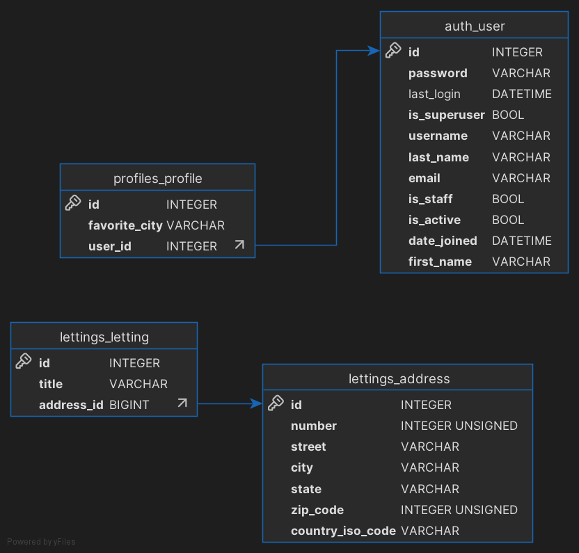

Database
========

As mentionned earlier, we used SQLite for this project

Entity Relationship Diagram
---------------------------

Interpretation by Django
------------------------
Django Framework, based on python is Class oriented language. This mean that tables are created from *Models*. Models are stored in different *models.py* files.

Each one of them are stored in *application*

Examples here
    * lettings/models
    * profiles/models

In application lettings you will find Address and Letting models

In profiles application you will find Profile model, with a ForeignKey on Django User Base Model

Here is the Profile Model

Django Admin
~~~~~~~~~~~~

Django come with an admin section that can be found here::

    http://localhost:8000/admin

This is basically a direct reading of Database

Command SQLite to navigate through the database
-----------------------------------------------
*This list come from README.MD*

    * Locate your file
    * Open shell session *sqlite3*
    * Connect to databse *.open oc-lettings-site.sqlite3*
    * Display tables *.tables*
    * Display column names in profiles table, *pragma table_info(oc_lettings_site_profile);*
    * Launch SQL request on profiles table, *select user_id, favorite_city from oc_lettings_site_profile where favorite_city like 'B%';*
    * *.quit* to quit sqlite3 shell

Quickly display base
~~~~~~~~~~~~~~~~~~~~

Visit this `website <https://inloop.github.io/sqlite-viewer/>`__

Simply drag and drop your SQLite file to check databse informations