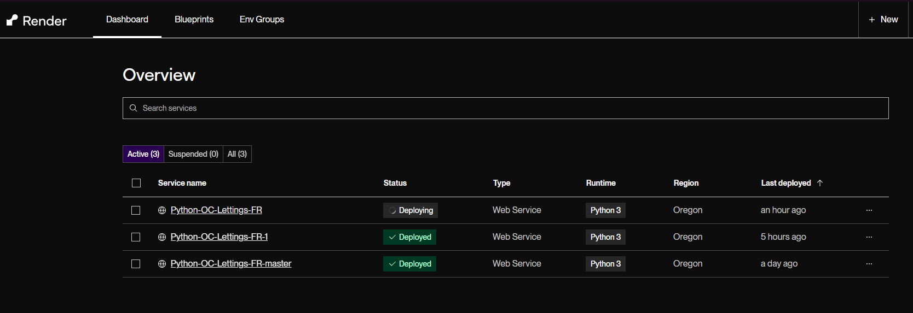
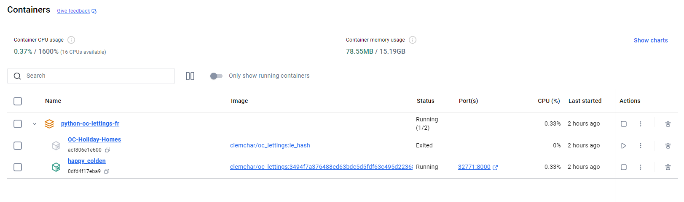
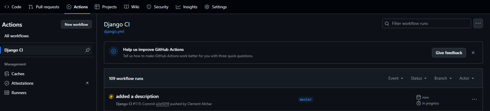
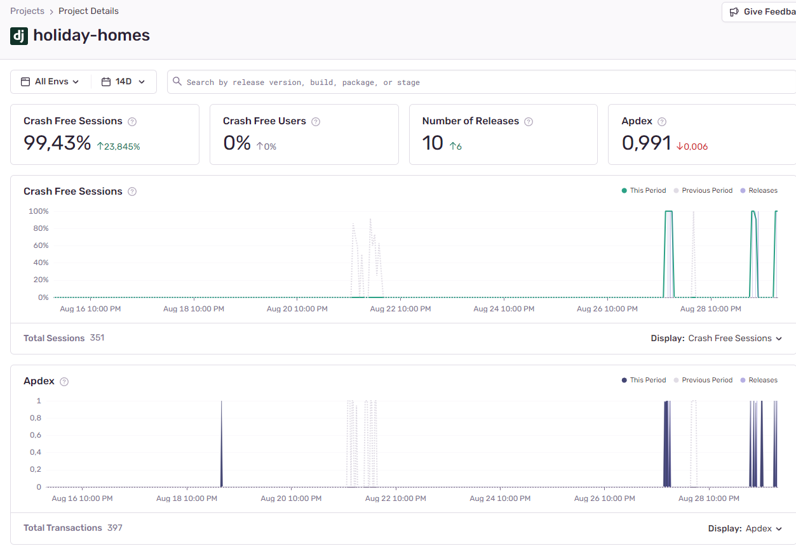
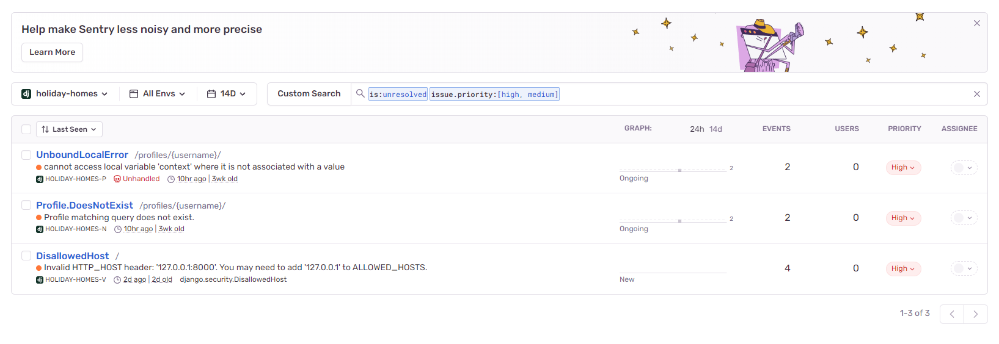

Interfaces
===========

Render
-----------

Monitor your deployments and configure your services

Docker
-----------

Build, push, run, pull and monitor your images and containers through its desktop application

Github Actions
---------------

In actions you can see your workflows details and lists, debug and rerun your jobs if you have to

Sentry
-------------

Sentry is making it easier to debug your projects