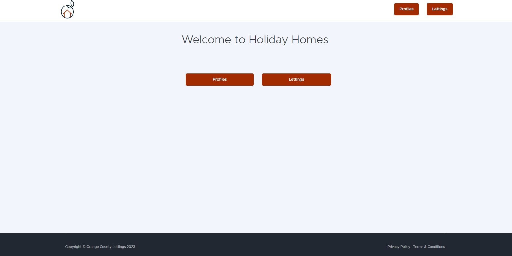
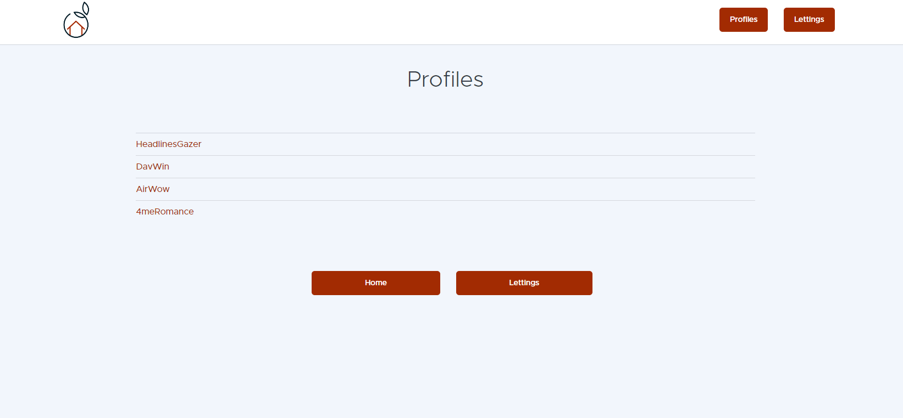
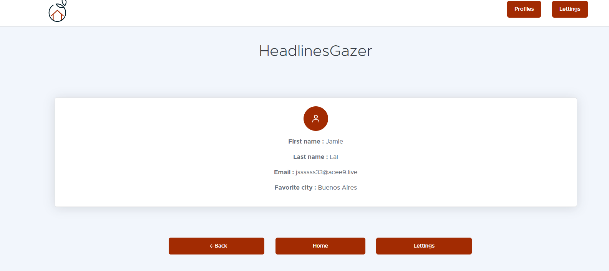
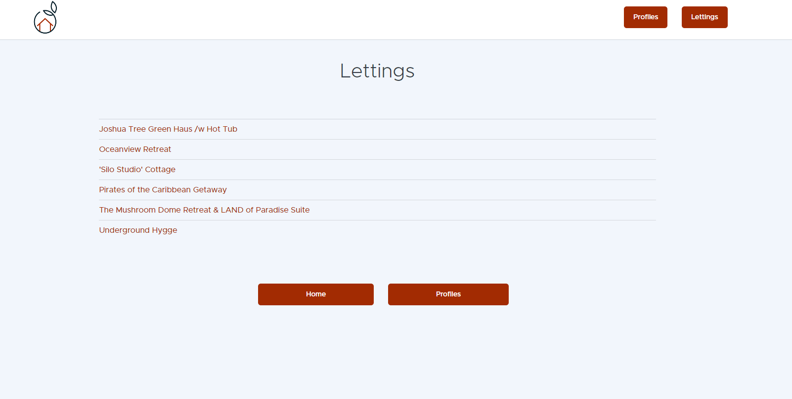
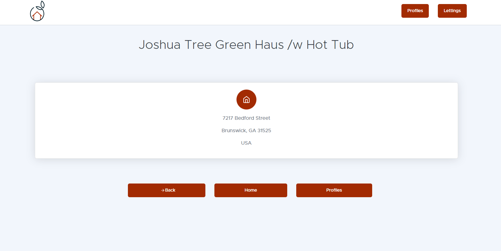

Usage Guide
===========

Whether you start this project or use the site, here are the instructions for using it properly 

Notes : 
    * You can at any time click on logo in the header to go back to main page
    * In subpages you can click on the bottom button to navigate to the specified page

Main Page
---------
Use Case : The user launch the website

Here you can see two buttons :
    * On the left button "Profiles" you have access to the list of all profiles registered
    * On the right button "Lettings" you have access to the list of all lettings registered

Profiles Main Page
------------------
Use Case : The user wants to see all profiles

Here you can see the list of registred profiles

You can click on a profile to enter his details

Profile Details Page
--------------------
Use Case : The user wants to see the details of a profile

Here you can see the details of a profile

Lettings Main Page
------------------
Use Case : The user wants to see all lettings

Here you can see the list of registred lettings

You can click on a letting to enter his details

Letting Details Page
--------------------
Use Case : The user wants to see the details of a letting

Here you can see the details of a letting

